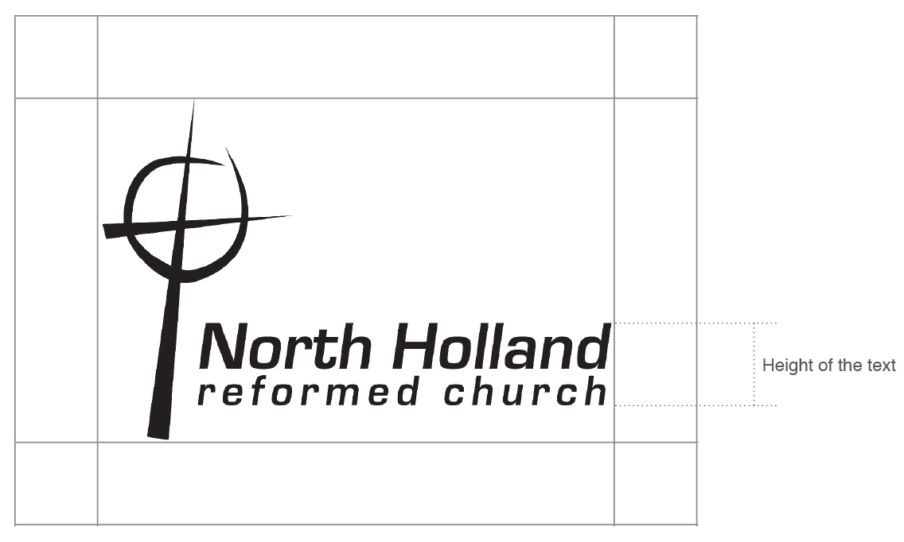
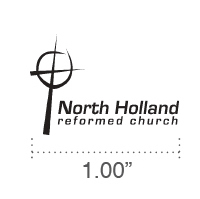
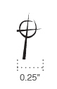

# North Holland Reformed Church

## Identity Guide

  

April 2017

### Table of Contents

1. [Logo](#logo)
2. [Color](#color)
3. [Clear Space & Sizing](#clearspacesizing)
## Logo

North Holland Reformed Church (NHRC) is a church of hospitality. People all arrive as travelers on a journey, and the members of NHRC do their best to make everyone feel welcomed and comfortable. Whether it be through conversation, homemade meals and desserts, or offering to help with projects or watching children, the people here are ready to rally for the needs of others.

The logo of NHRC embodies the driving force for our love and embrace: the grace of the cross. Because we have been forgiven and loved, we want to share that in any way we can.

The logo also loosely resembles a compass. We look to scripture and prayer to point us in the direction of God's will, doing our best to follow His path rather than our own in this journey.

Finally, the logo has an open circle. There is always room for one more, the door is always open here.

  

    
  

  

    
  

## Color

### Primary Palette

The primary color palette is a selection of colors that should be the first colors to consider for all media.

  

  * **CMYK** C76 / M0 / Y5 / K53
  * **RGB** R0 / G108 / B134
  * **HEX** #006C86

  

  * **CMYK** C0 / M62 / Y76 / K4
  * **RGB** R234 / G122 / B72
  * **HEX** #EA7A48

  

  * **CMYK** C75 / M68 / Y67 / K90
  * **RGB** R0 / G0 / B0
  * **HEX** #000000

  

  * **CMYK** C0 / M0 / Y0 / K0
  * **RGB** R255 / G255 / B255
  * **HEX** #FFFFFF

### Secondary Palette

The secondary color palette is a selection of supporting colors.

  

  * **CMYK** C36 / M0 / Y15 / K31
  * **RGB** R118 / G162 / B165
  * **HEX** #76A2A5

  

  * **CMYK** C2 / M6 / Y79 / K0
  * **RGB** R255 / G229 / B85
  * **HEX** #FFE555

## Clear Space & Sizing

When using the primary logo, maintain about the height of the 2 lines of text as space around the logo. When in doubt, add more space.

The primary logo should never be printed smaller than 1" in width, or displayed at a width less than 120px in digital applications.

When used by itself, the cross icon should never be printed lass than 0.50" in width, or displayed at a width less than 30px in digital applications.

